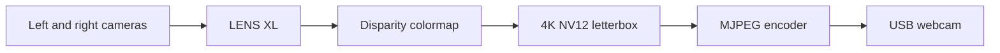

# Plan: LENS XL depth webcam

Date: 2026-09-10. User selected LENS XL for maximum visual quality.

## Boundary and method
Change the existing standalone webcam customization point to CAM_B/C → built-in NeuralDepth EXTRA_LARGE (1248×780) → ApplyDepthColormap → letterboxed 3840×2160 NV12 → existing MJPEG/USB bridge. Run sensors at the reference 10 FPS; expect roughly 9 new depth frames/s; USB advertises 30 FPS and may repeat the latest frame. Upscaling does not add depth detail. RGB, metric overlays and tuning are deferred.

Reference: luxonis/oak-examples/neural-networks/depth-estimation/neural-depth, current Luxonis NeuralDepth and ImageManip documentation. Use SDK 3.10.0 and depthai-nodes 0.6.1; built-in Luxonis model, no custom third-party model.

## Output
OAK4 Webcam shows near surfaces red, far surfaces blue, and invalid depth black. Colors adapt to scene percentiles and are not a fixed metric scale.

## Validation
Check imports and output contract, rebuild the existing app after stopping its camera owner, capture and decode host UVC frames, open a representative image, and measure delivery. Keep evidence under evidence/2026-09-10-lens-xl/. Standalone USB needs live proof; holistic replay remains pending. No matching recording exists; use the real scene with motion.
