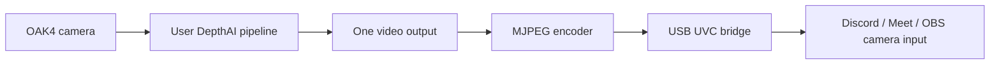

# Plan: OAK4 customizable webcam

- Date: 2026-09-10
- Status: Implemented and locally tested; device packaging/live validation blocked by device DNS and clock
- Brief: ../brief.md

## First demo

Prove one customizable video output appears as a USB camera on the host. Start with RGB, 1920x1080 at 30 FPS, MJPEG, matching the reference. Defer audio, dynamic modes, graphical editing and simultaneous applications.

## Approach

- Starting DepthAI v3 example: luxonis/oak-examples cpp/uvc, confirmed by Luxonis MCP.
- Method: deterministic video transport; no model downloads.
- Topology: standalone OAK App, USB UVC to the user's computer.
- Expose a Python pipeline.py customization point: build_pipeline(pipeline) returns one DepthAI image output. The runtime owns pipeline lifecycle and links that output to MJPEG encoding.
- Adapt the reference native UVC transport into a small bridge receiving length-prefixed MJPEG frames over a local Unix socket from Python. Bound frame size and buffering, handle reconnects and drop stale frames. Prove this bridge with real frames before extending customization.
- Validate selected output dimensions/type; bound buffering; avoid truncating encoded frames; support graceful shutdown and repeat open/close.
- Build against precompiled DepthAI, never compile the SDK from source.
- Audit USB gadget setup/cleanup to preserve existing functions. Rebinding USB can temporarily disconnect USB management; prefer Ethernet for deployment/testing when available.
- Package using oakapp.toml and the installed oakctl app build/run workflow.

## Pipeline



## UI / output mockup

```text
Camera selection: OAK4 Webcam
Preview: live output of the custom pipeline
```

The user edits Python pipeline.py. Exactly one selected image output feeds the webcam, even if the internal pipeline has other branches. The first contract requires 1920x1080 NV12 at 30 FPS. Depth/detections must be rendered into a compatible image before selection.

## Recording

No matching recording identified. This standalone USB gadget path needs live hardware proof; holistic replay is pending and cannot prove USB enumeration. Use a moving scene and a visible pipeline modification. Store validation artifacts under evidence/.

## Validation

| Check | How | Passes when |
| --- | --- | --- |
| Packaging | oakctl app build | An installable .oakapp is produced |
| Enumeration | Host camera listing | One UVC camera advertises the intended mode |
| Video | Capture/decode on host | Moving frames have expected size and no corrupt frames |
| Customization | Change pipeline rendering | Host sees the changed output |
| Consumers | Discord, Meet, OBS separately | Each displays live output |
| Lifecycle | Open, close, reopen; stop app | Streaming resumes; existing USB functions remain usable |

## Assumptions

USB data connection with sufficient power; compatible device OS; no competing pipeline. USB transport and Python language are confirmed. Host OS and accessible target device remain to be confirmed. Local oakctl is 0.29.1. The local UVC submodule is not populated; fetch its pinned revision during implementation. Isolated Python environment setup is pending implementation.
