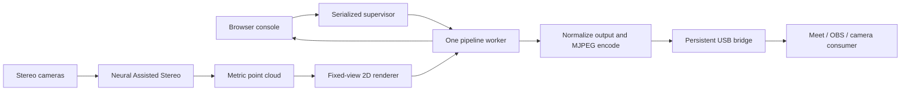

# Plan: fixed-view point cloud and live preset console

User authorized implementation, parallel agents, commits, push and a documented PR on 2026-09-10. Continue the existing standalone application.

## Demo boundary

Preserve prepared presets including NAS. Add RGB-colored and depth-colored metric point clouds rendered from a fixed virtual camera into 2D webcam video. Provide front and angled view settings, adjustable in the browser and fixed after application. Provide a browser console to list presets, inspect a preview/status and switch pipelines without starting competing camera owners. Support loading a trusted user-provided .py file with the build_pipeline contract, selected by a path in the OAK app filesystem. Keep startup USB geometry stable; normalize prepared source outputs to that geometry. During handover the bridge retains the last frame. Failed switches report errors and attempt rollback. Continuous 3D orbit interaction, raw point-cloud network protocols and graphical pipeline editing are deferred.

## Method and topology

DepthAI v3 NeuralAssistedStereo verified with Luxonis MCP/API docs. PointCloud follows the current Luxonis point-cloud showcase, with a bounded deterministic CPU renderer, metric false colors, fixed view and depth-tested occlusion. No host display server required. A local browser console talks to an authenticated Python HTTP supervisor; one worker at a time owns the pipeline. The existing bridge owns USB throughout switches.

## Output mockup

Console: current preset, source/output dimensions, worker status, preview, preset selector and Apply button. Distinguish switching, fresh output, failure and rollback. Webcam point-cloud view: stable perspective and distance color scale, black invalid/background areas. View settings are startup configuration, not scene auto-fit.

## Proof

Single root agent owns hardware. Unit tests cover projection, occlusion, invalid points, exclusive process handover, failure rollback and HTTP authorization. Capture and decode actual NAS/point-cloud frames via the existing running app path; inspect each claimed image. Verify console switching and a fresh frame after each change. Verify USB consumer separately where available without displacing an active consumer. Keep evidence under evidence/. Standalone holistic replay is pending; a recording would need textured and untextured near/far surfaces, motion and occlusion.
