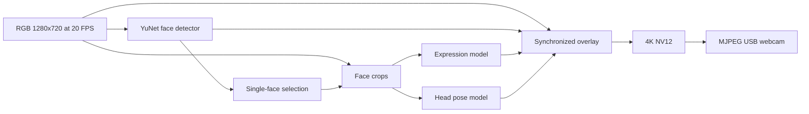

# Plan: prepared webcam presets and facial cues

Date: 2026-09-10. User requested an additional model pipeline and preservation of all tried presets. Existing standalone OAK4 USB app; no second app.

## Demo boundary
Provide rgb-1080p, rgb-4k, lens-xl, and face-attention, selected by OAK_WEBCAM_PRESET. Resolve the USB mode and Python output contract from the same registry. A restart changes presets; live switching and multiple simultaneous pipelines are deferred.

Face preset: YuNet 640×360 detects faces; one face is cropped into Emotion Recognition 260×260 and Head Pose Estimation 60×60. Display expression estimate, model score, head angles and a facing-camera streak. These visible cues do not measure internal mood or attention span. No identification, persisted attention history or clinical claims. More than one face suppresses estimates and resets the timer.

Reference examples: luxonis/oak-examples/neural-networks/face-detection/emotion-recognition and head-posture-detection. SDK 3.10.0, depthai-nodes 0.6.1. Model references and licenses are recorded in THIRD_PARTY.md. Download models before binding USB and starting the bridge timeout.

## Output mockup
Expression estimate: neutral (score 0.74)
Head: facing camera
Facing-camera streak: 12.3s
Yaw +2 Pitch -4 Roll +1 deg
Visible cues only - not mood or attention-span measurement

## Validation
Test preset mode consistency, invalid selection rejection, USB cleanup, no-face/away/stale timer resets. Build and run the new preset on the OAK; inspect startup and a final image or user-confirmed live output. Exercise the face/no-face branch when scene permits. Preserve evidence under evidence/2026-09-10-face-attention/. Standalone USB cannot be proven by holistic replay; replay remains pending. User confirmed LENS XL works and explicitly requested no further investigation of that preset.
